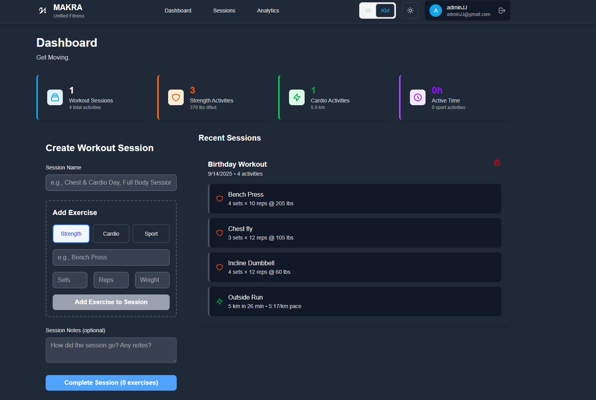
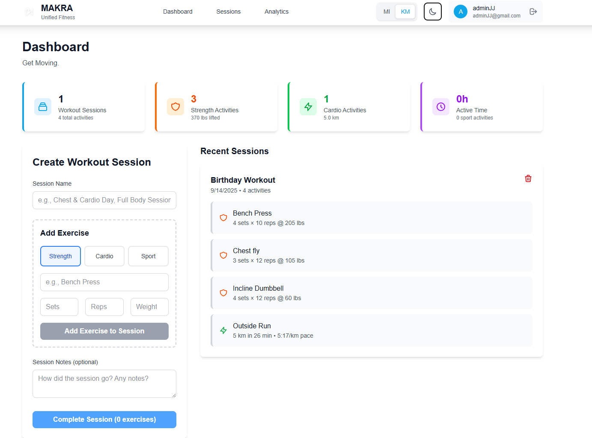
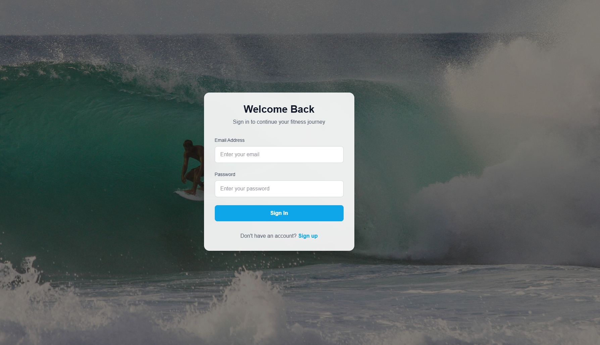

# Makra - Unified Fitness Tracking

## The Problem I'm Solving

I'm tired of juggling multiple apps for my fitness tracking. Hevy for weightlifting, Strava for running and cycling, random apps for sports. It's messy, my data is scattered, and I can't see my complete fitness picture in one place.

I want one app that handles everything - strength training with proper set/rep tracking, cardio with distance and pace, and sports activities with duration. Most importantly, I want to group different activities into workout sessions because that's how I actually train.

## What I'm Building

A unified fitness platform that combines the best of Hevy and Strava into one clean interface. No unnessecary features, just what I actually need:

- Session-based workout tracking (group multiple activities together)
- Proper strength training logs with sets, reps, and weight
- Cardio tracking with distance, pace, and duration
- Sports activity logging
- Dark mode because my eyes hurt

## What's Next

Once I validate this MVP works for my daily use, I'll expand with:
- Analytics and progress tracking
- Social features and workout sharing
- Communities with challenges
- Exercise database and suggestions
- Mobile app (React Native or Flutter)
- Advanced metrics and insights

This README will get proper documentation, screenshots, and setup instructions once the core features are solid. Right now I'm focused on building something I actually want to use every day.

## Current Status

This is my MVP. I'm actively using it to track my workouts while building it. The core functionality works:

- User authentication and profiles
- Create workout sessions with multiple exercises
- Track strength, cardio, and sport activities
- View workout history and basic stats
- Unit system toggle (miles/km, min/mile vs min/km)
- Full dark/light mode support
- Responsive design that works on mobile

**The current landing page**


**The current dashboard light and dark modes**


*personally don't like the design of the dashboards want to get more opinions though*
Analytics and the Social feed is still in progress

**Login and Register Pages**



## Tech Stack

**Backend:**
- Node.js with Express
- MongoDB with Mongoose
- JWT authentication
- Bcrypt for password hashing

**Frontend:**
- Next.js 15 with React 19
- TypeScript for type safety
- Tailwind CSS v4 for styling
- React Hook Form with Yup validation
- Axios for API calls

## Running the App

Backend:
```bash
cd fittrackapp
npm install
npm start
```

Frontend:
```bash
cd frontend
npm install
npm run dev
```

Set up your `.env` file with MongoDB connection string and JWT secret. The app runs on localhost:3000 (frontend) and localhost:5000 (backend).

---

### Prerequisites
- Node.js
- MongoDB
- Postman
- Git

### Installation

1. **Clone the repository**
bash
git clone https://github.com/kendymann/workoutapp.git
cd workoutapp
2. **Install dependencies**
bash
# Install backend dependencies
npm install
# Install frontend dependencies
cd client npm install
3. **Environment Setup**
bash
# Create .env file in root directory
cp .env.example .env
# Add your environment variables
MONGODB_URI=your_mongodb_uri
JWT_SECRET=your_jwt_secret
PORT=5000
4. **Start the application**
bash
# Run backend (from root directory)
npm run server
# Run frontend (from client directory)
npm run server

## Usage

1. Register an account or login
2. Create your first workout routine
3. Log your exercises and sets
4. Track your progress through the dashboard
5. Set and monitor fitness goals

## Contributing

Hit me up @ jaydentruongcrt@gmail.com if you are interested in helping.

## Acknowledgments

- [React Documentation](https://reactjs.org/)
- [MongoDB Documentation](https://docs.mongodb.com/)
- [Express.js Documentation](https://expressjs.com/)
- [Node.js Documentation](https://nodejs.org/)

---


